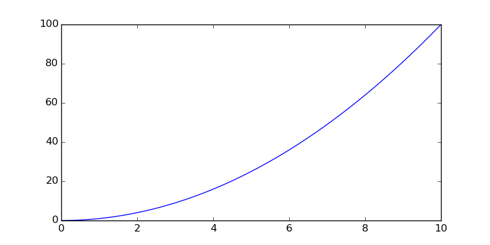
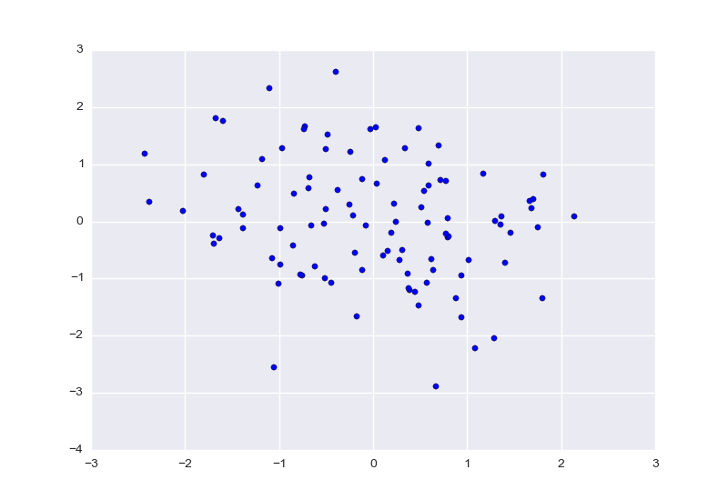
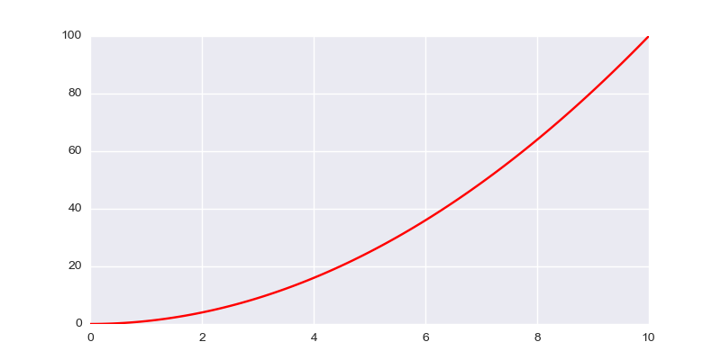
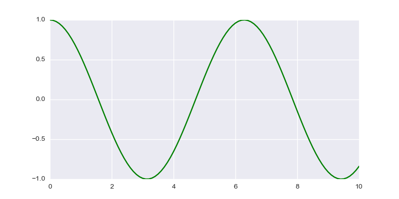

Introduction to literate.py
===========================
:Authors: Enrico Giampieri

.. contents:: :depth: 1

Intro
-------------------

*Literate.py* is a simple python library that is used to compile
normal python script into scienfic reports, with an approach
similar to that commonly refered as **literate programming**.

*Literate.py* is based on a simple idea: the isolated string
in your program get turned into the text of the report, while
the code is reported as evidenced.
The usage of long strings in python allows to write the text
in a comfortable way. The syntax used to parse the text is the
ReStructured Text, the language of markup chosen for the python
documentation.

Any output from the code is captured and printed in the report as verbatim.
It also tries its best to capture and insert any figure created with
matplotlib and pylab.

The output is properly formatted as ReStructured Text, including math:

.. math::

    \lambda = x_0^2

.. code:: python

    
    print("capture this line!")
    

::

    capture this line!
    

The library execute the script as the main script, and it does
transmit the parameters given from the command line.

This script has been compiled as::

    python literate.py introduction.py -nope

the script will execute as it was launched with::

    python introduction.py -nope

.. code:: python

    
    import sys
    
.. code:: python

    
    
    if __name__ == '__main__':
        print("this is inside the main loop")
        print(sys.argv)
    

::

    this is inside the main loop
    ['/home/PERSONALE/enrico.giampieri2/progetti/literate.py/introduction.py', '-nope']
    

note that each block of code is represented with a different gray line.
This is meant to help understand the relationships between the different
lines and how they are executed together.

.. code:: python

    
    print(1)
    

::

    1
    

.. code:: python

    print(2)
    

::

    2
    

if you need to insert a string literally, you can just put a semicolon ;
at the end of it. It is equivalnt from the syntax point of view, but
it will not be recognized as a piece of documentation.

.. code:: python

    
    """this is a regular string, not a formatted one
    """;
    
the library should be able to distinguish regulare output (stdout)
and error output (stderr) and represent them accordingly

.. code:: python

    
    
    print("capture this line!", file=sys.stderr)
    

.. warning::

    capture this line!
    

It does not catch exceptions. Your code is supposed to work correctly.
If your code run, then it should be compiled without any problems.
Debugging an error from the sandboxed code it extremely hard,
so to discourage the practice it raises the exception without any filtering,
only with a reference to the code source that generate the error.

Docstrings
---------------

the proper docstrings of functions or classes are included in the code
and then rendered afterward. this will allow the system to maintain the
same properties of the code while showing the correct formatted docstrings.

.. code:: python

    
    def my_fun():
        """this function does nothing, but has the interesting math property:
    
        .. math::
    
            |x| * 0 = |x*0|
        """
        def my_fun2():
            """nested functions and docstring are handled without problems
            """
            pass
        return my_fun2
    
.. note::

    .. code:: python

        def my_fun():

    this function does nothing, but has the interesting math property:
    
        .. math::
    
            |x| * 0 = |x*0|
        

.. note::

    .. code:: python

        def my_fun2():

    nested functions and docstring are handled without problems
            

Pylab
-----------------

it can also capture matplotlib figures on the fly, maintaining all the
configurazione in the appropriate way

.. code:: python

    
    import pylab
    
.. code:: python

    fig, ax = pylab.subplots(1, 1, figsize=(8, 4))
    
.. code:: python

    x = pylab.linspace(0, 10, 101)
    
.. code:: python

    ax.plot(x, x**2)
    
.. code:: python

    fig.show()
    

to show the plot it is necessary to explicitly call the show method,
no shortcut available!

but if you already have shown the figure (in this case the the :code:`fig.show()`),
it will not appear twice

.. code:: python

    
    pylab.show()
    
if external libraries are used, they interact in the expected way

.. code:: python

    
    
    import seaborn as sns
    
.. code:: python

    pylab.figure()
    
.. code:: python

    pylab.scatter(pylab.randn(100), pylab.randn(100))
    
.. code:: python

    pylab.show()
    

multiple figures can be plotted all at the same time with a single
show, as it would be expected

.. code:: python

    
    fig, ax = pylab.subplots(1, 1, figsize=(8, 4))
    
.. code:: python

    x = pylab.linspace(0, 10, 101)
    
.. code:: python

    ax.plot(x, x**2, color='r')
    
.. code:: python

    
    import numpy as np
    
.. code:: python

    fig, ax = pylab.subplots(1, 1, figsize=(8, 4))
    
.. code:: python

    x = pylab.linspace(0, 10, 101)
    
.. code:: python

    ax.plot(x, np.cos(x), color='g')
    
.. code:: python

    
    pylab.show()
    

